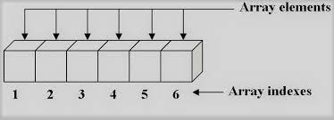

# Wat zijn Arrays? 

In een array kun je lijsten / verzamelingen gegevens opslaan. Denk aan een lijst met temperaturen, namen, prijzen etc.
Een array bevat dus meerdere waarden en dat is handig. Je kunt al die waarden in één variabele opslaan.

Zo maak je een array in PHP (beide regels doen hetzelfde, de tweede regel is wat minder typen):

```php
// Lege array maken (langere manier)
$data = array();

// Lege array maken (kortere manier)
$data = []

// Langere manier, met gegevens
$dagen = array("maandag", "dinsdag", "woensdag", "donderdag", "vrijdag", "zaterdag", "zondag");

// Verkorte manier, met gegevens
$dagen = ["maandag", "dinsdag", "woensdag", "donderdag", "vrijdag", "zaterdag", "zondag"];
```

Het 1e element in een array heeft index 0, het 2e index 1 enzovoorts. Om "donderdag" op te halen kun je de index 3 gebruiken:



```php
echo $dagen[3]; 
// Er wordt "donderdag" op het scherm gezet
```

Een array kun je **NIET** met `echo $namen` op het scherm zetten (zoals een tekst of een getal)

Je kunt wel `var_dump()` of `print_r()` gebruiken.

```php
// Print de array in tekst formaat
print_r($dagen);   

// Geeft wat extra info over het soort data dat er in zit
var_dump($dagen); 
```


---

Er zijn veel [array functions](https://www.php.net/manual/en/ref.array.php) in PHP om met arrays te werken. Hier wat voorbeelden.

Gebruik [count()](https://www.php.net/manual/en/function.count.php) om het **aantal** elementen terug te krijgen:

```php 
echo count($dagen); 
// 7
``` 

Iets toevoegen aan een array kan met [array_push()](https://www.php.net/manual/en/function.array-push.php) of met de korte versie: `[]`

```php
// Lange manier
array_push($dagen, "nog een dag");

// Verkorte manier 
$dagen[] = "nog een dag";

De array $dagen wordt bevat nu een extra element
echo count($dagen); // 8
```

Met [implode()](https://www.php.net/manual/en/function.implode.php) kun je alle elementen aan elkaar plakken en omzetten in een string (met een scheidingsteken)

```php
echo implode(' >> ', $dagen);
// maandag >> dinsdag >> woensdag >> donderdag >> vrijdag >> zaterdag >> zondag >> nog een dag
```

Sorteren kan ook:

```php
// Sorteer op alfabet
sort($dagen);
echo implode(' >> ', $dagen);
// dinsdag >> donderdag >> maandag >> nog een dag >> vrijdag >> woensdag >> zaterdag >> zondag
```

En zo zijn er nog veel meer functies die je kunt gebruiken. Je vind ze in de documentatie :-)

---

### Opdrachten
{: .text-blue-100 .fs-6 }

**Belangrijk bij deze opdrachten is dat je de [PHP-documentatie](https://www.php.net/manual/en/ref.array.php){: target="_blank"} leest zodat je weet hoe je bepaalde functies moet gebruiken!**

*Zet ook comments in je code, met uitleg over wat de code doet*

1. Maak eerst een nieuw bestand `arrays.php` met een HTML start structuur. 
2. Vraag het bestand op via localhost in je browser (is nu dus een lege webpagina)

Maak nu deze code opdrachten in `arrays.php`:

- Zet een start en eind PHP tag binnen de `<body>HIER DUS</body>` van je HTML-document (daar wil je de PHP output krijgen)
- Declareer een variabele `$namen` en sla daarin een array op met minstens 5 namen uit je klas.
- Gebruik `echo` en `count()` om het aantal namen in de variabele `$namen` op het scherm te zetten 
- Sorteer de array met `sort()` (let op deze functie geeft niets terug maar verandert de array direct)
- Gebruik `print_r()` om de `$namen` array op het scherm te "dumpen"
- Haal de laatste naam op met `array_pop()` en zet deze op het scherm;
- Voeg een nieuwe naam toe met `array_push()`
- Voeg een nieuwe naam toe met via de `$namen[]` methode
- Gebruik weer `print_r()` om de `$namen` array op het scherm te "dumpen"
- Gebruik de `implode()` met `<br>` als separator om de namen naar een tekst om te zetten. Sla dit op in de variabele `$namen_tekst`
- echo `$namen_tekst` op het scherm. Wat is er gebeurd?
- Nu andersom: Gebruik `explode()` om deze tekst naar een array om te zetten (sla het resultaat op in een nieuwe variabele)
- Gebruik nu weer `print_r()` om te zien wat er in de nieuwe variabele zit.


**Tip**: Om nieuwe regels in HTML te krijgen moet je dus ook een `<br>` toevoegen aan de `echo`, anders komt alles achter elkaar op het scherm

---

Hier vind je meer info over arrays en handige array functions in PHP:

- [https://code.tutsplus.com/tutorials/working-with-php-arrays-in-the-right-way--cms-28606](https://code.tutsplus.com/tutorials/working-with-php-arrays-in-the-right-way--cms-28606)
- [https://www.php.net/manual/en/language.types.array.php](https://www.php.net/manual/en/language.types.array.php)
- [https://www.php.net/manual/en/ref.array.php](https://www.php.net/manual/en/ref.array.php)

