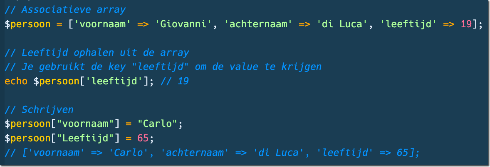
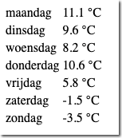

# Associatieve arrays

Lees in de Les 3 PDF (op Teams te vinden) hoe je een *associatieve* array kunt maken. Hier nog een voorbeeld:

### Opdrachten
{: .text-blue-100 .fs-6 }

Maak een nieuwe bestand `array_assoc.php` met daarin een HTML start document en zet alle PHP-code weer in de `<body>` van je HTML (en tussen de start en eind PHP-tags uiteraard!)

- Zoek de weersvoorspelling voor komende week op internet.
- Maak nu een associatieve array met als `key` de weekdag en als `value` de temperatuur voor die dag (verzin zelf een duidelijke naam voor de array variabele).
- Gebruik de `print_r()`function om de structuur op het scherm te zetten.
- Maak nu in HTML een [table](https://developer.mozilla.org/en-US/docs/Learn/HTML/Tables/Basics#active_learning_creating_your_first_table) met voor elke dag een rij. Zet in kolom 1 de naam van de dag
  - Lukt een `<table>` niet, zet het dan op je eigen manier in HTML & CSS zodat het er duidelijk uitziet.
- Haal nu met PHP de temperatuur voor die dag (dat is de key) uit de array en gebruik `echo` om die in de tweede kolom te zetten
- Zet ook het celsius teken &celsius; achter de temperatuur (zoek dat op via Google). 

Hier lees je [hoe je een table maakt](https://developer.mozilla.org/en-US/docs/Learn/HTML/Tables/Basics#active_learning_creating_your_first_table):

Dit zou het resultaat ongeveer zijn (uiteraard met de juiste temperaturen).

**Bonus uitdaging**\ 
Voeg een CSS-bestand toe en maak het mooier qua kleuren, lettertype etc. Je kunt bijvoorbeeld de `table` en `td` een kleurtje geven. Of zet de temperatuur tussen `` en gebruik CSS om de temperatuur een eigen stijl te geven.   

Zoiets zou je dan kunnen krijgen:

---
